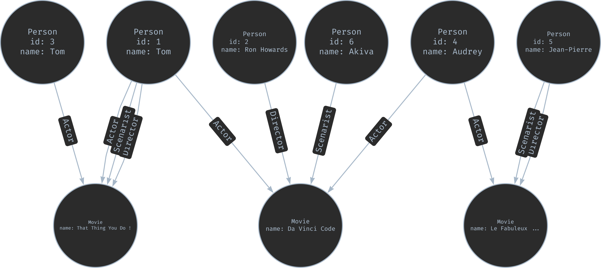

# Examen NoSQL and NewSQL 2024-2025

</br>

- ## Exercice 1 :

    1. $4433 + 661(251){^*}(233 + 433 + 255)$

    2. $\{(4, 3), (6, 3), (6, 5)\}$

    3. $\{(4433), (661233), (661433), (661255)\}$

    4. $\{(4433), (661255), (661233), (6612433), (6612551433)\}$

</br>

- ## Exercice 2 :

    

</br>

- ## Exercice 3 :

    6. **Est-il possible de trouver une RPQ et un graphe tels que la sémantique d’extremité (endpoint semantics) ne renvoie rien mais que la sémantique de plus-courtchemin (shortest semantics) renvoie quelque chose.**

        ```
        Impossible
        Si l'ensemble des chemins est vide (Endpoint ne renvoie rien), alors il n'existe aucun chemin à mesurer pour la Shortest semantics.
        ```

    </br>

    7. **Est-il possible de trouver une RPQ et un graphe tels que la sémantique de pluscourt-chemin (shortest semantics) ne renvoie rien mais que la sémantique sans répétition (trail semantics) renvoie quelque chose.**

        ```
        Impossible
        S'il y a des match de S à T pour la RPQ, alors il y a au moins un de ces chemins que l'on va retrouver dans la shortest semantics
        ```

    </br>

    8. **Est-il possible de trouver une RPQ et un graphe tels que la sémantique sans répétition (trail semantics) ne renvoie rien mais que la sémantique d’extremité (endpoint semantics) renvoie quelque chose.**

        ```
        Possible
        Q = SST
        Trail semantics : {} (répétition de l'arête 1->1 dans 1112) 
        Endpoint semantics : {(1, 2)}
        ```
        

    </br>

    9. **Est-il possible de trouver une RPQ et un graphe tels que la sémantique sans répétition (trail semantics) renvoie un nombre polynomial de résultats et que la sémantique de plus-court-chemin (shortest semantics) renvoie un nombre exponentiel de résultats.**

        ```
        Impossible
        pas de justification trouvé

        correction :
        Pour une paire (s, t) donnée, la sémantique de plus-court-chemin renvoie des chemins qui ont tous la même longueur (la longueur minimale). Le nombre de ces chemins peut être élevé, mais il ne peut pas être "plus exponentiel" que l'ensemble de tous les chemins sans répétition.
        Le nombre de résultats en Shortest semantics est toujours inférieur ou égal au nombre de résultats en Endpoint semantics (puisqu'on filtre par longueur).
        Surtout, la sémantique de plus-court-chemin peut être calculée en temps polynomial (via une variante de l'algorithme de Dijkstra ou BFS), ce qui limite structurellement l'explosion du nombre de résultats "utiles" par rapport aux chemins sans répétition qui, eux, peuvent être très nombreux dans des graphes complexes.
        ```

</br>

- ## Exercice 4 :

    10. ```sql 
        match (ent:Entrepot) return ent.id
        ```

    11. ```sql
        match ()-[r:ROUTE]-()
        where r.longueur > 10
        return count(distinct r)
        ```

    12. ```sql
        match (a)
        where a.id = 42
        detach delete a
        ```


